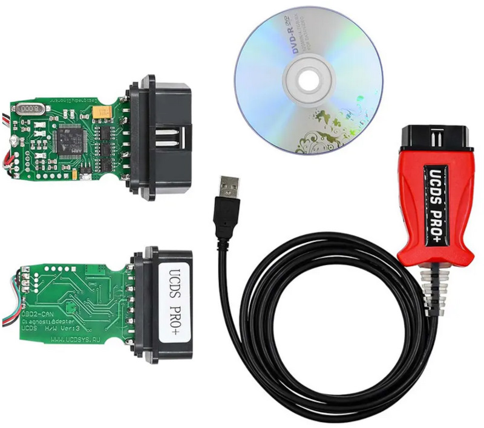
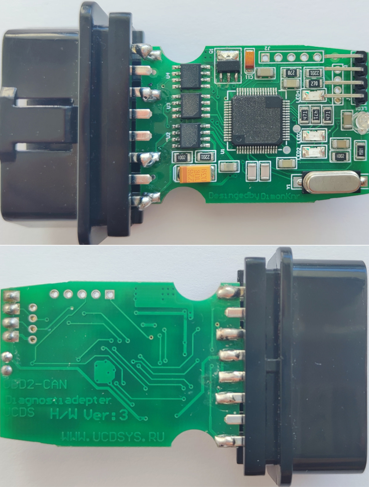
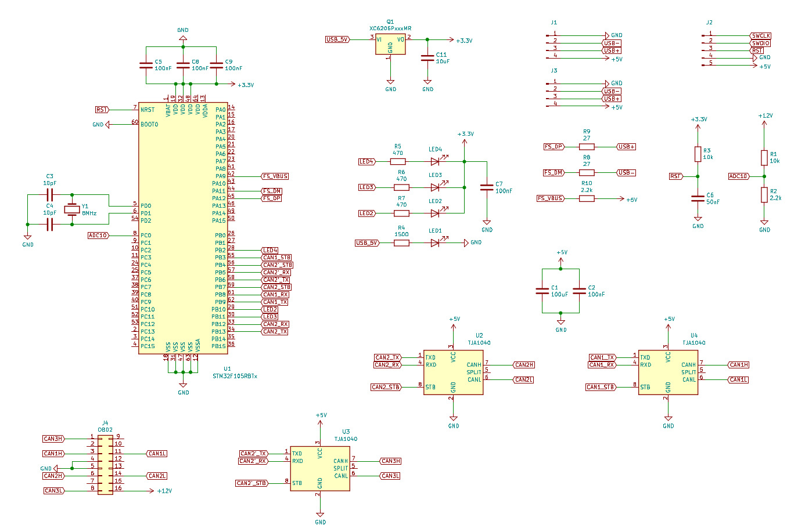

# ucds
Alternative Firmware for the chinese clone of ucds adapter which is available on aliexpress

The following firmware files are available:
- **bl.bin** - bootloader with usb dfu implementation
- **slcan.dfu/slcan-win10.dfu** - dual cdc-acm implementation with lawicel protocol, canonical canhacker gui can be used from https://www.mictronics.de/posts/USB-CAN-Bus
- **ch.dfu** - implementation of a dual-can russian canhacker from https://canhacker.ru
- **gs.dfu** - implementation of a dual-can CandleLight/GS adapter, on Linux OS this is a standard socketcan dual adapter, on Windows OS this adapter can be used with [Cangaroo](https://github.com/smartgauges/cangaroo) or [SavvyCan](https://github.com/smartgauges/SavvyCAN) applications

[More info](https://www.drive2.ru/b/667217191912868584/)

